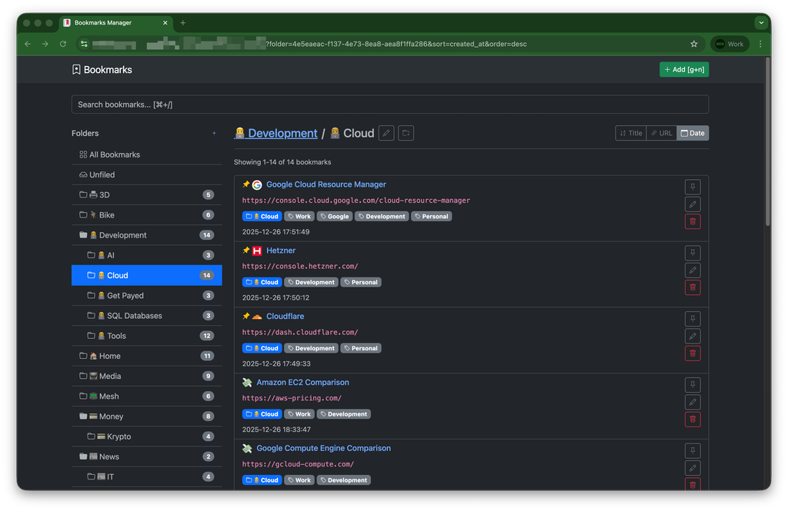

# Bookmarks Manager

[](#readme)
[](#readme)
[](#readme)
[](#readme)
[](#readme)
[](#readme)
[](https://www.gnu.org/licenses/agpl-3.0)

Bookmarks Manager is a lightweight, self-hosted bookmarking solution designed for speed and simplicity. Optimized for a single user, it features a simple SQLite backend and single user HTTP Basic Authentication, making it incredibly easy to deploy and maintain.

Written in Go, it ships as a single self-contained binary with all templates and static assets embedded, so there are no runtime dependencies to install.

Take control of your web links with a powerful organization system, lightning-fast search, and a mobile-friendly interface.



## Features

### 📁 Organization
- **Hierarchical Folders**: Organize bookmarks into folders and subfolders (unlimited nesting)
- **Multi-level Tags**: Tag bookmarks with multiple tags for flexible organization
- **Pinned Bookmarks**: Pin important bookmarks to keep them at the top of any list

### 🔍 Search & Navigation
- **Live Search**: Real-time search with dropdown results as you type
- **Full-text Search**: Search across titles, URLs, descriptions, folder names, and tags
- **URL-based Navigation**: Direct access via URLs (e.g., `/?folder=<id>`, `/?tag=<id>`)
- **Sorting**: Sort by title, URL, or creation date (ascending/descending)

### ⌨️ Keyboard Shortcuts
- **`⌘+/` or `Ctrl+/`**: Focus search field (OS-aware)
- **`g` then `n`**: Add new bookmark (Gmail-style sequential shortcut)
- **`↑` / `↓`**: Navigate search results
- **`Enter`**: Open selected result or submit search

### 🎨 User Interface
- **Bootstrap 5 Dark Mode**: Modern, responsive design optimized for desktop and mobile
- **Automatic Favicon Fetching**: Fetches and caches website favicons automatically
- **Mobile-Optimized**: Responsive layout works great on phones and tablets
- **Fast Interaction**: Minimal JavaScript, form-based interactions

### 📤 Import/Export
- **Firefox Import**: Import bookmarks from Firefox JSON export files
- **Firefox Export**: Export all bookmarks to Firefox-compatible JSON format
- **Preserves Structure**: Maintains folder hierarchy and tags during import/export

### 🔒 Security
- **HTTP Basic Authentication**: Simple username/password protection (constant-time comparison)
- **UUID-based IDs**: Uses UUIDs instead of sequential integers for all resources
- **Security Headers**: Sensible defaults (CSP, HSTS, X-Frame-Options, ...) on every response
- **Rate Limiting**: Built-in per-client-IP rate limiting

### ⚡ Performance
- **Single Binary**: Ships as one self-contained Go binary (templates and assets embedded)
- **SQLite Database**: Lightweight, serverless database (pure-Go driver, no CGO)
- **Favicon Caching**: Favicons cached locally to avoid repeated fetches
- **Optimized Queries**: Efficient database queries with proper indexing

## Getting Started

You can run the application locally or deploy it to a cloud platform like Google Cloud Platform.

The complete application is containerized and can be run with Docker, Podman or Kubernetes.
You can also build and run it locally with Go.
Deploying and running the application via a container is recommended.

**Clone the repository**:

```bash
git clone git@gitlab.com:Cyclenerd/bookmarks-manager.git
cd bookmarks-manager
```

### Local development

Prerequisites:

*   Go 1.26 or newer

No external database server is required; SQLite is embedded via a pure-Go driver.

1.  **Build the binary** (templates and static assets are embedded):

    ```bash
    go build -o bookmarks ./cmd/bookmarks
    ```

2.  **Run the application**:

    ```bash
    HTTP_AUTH_PASSWORD=changeme ./bookmarks
    ```

    Or run directly without producing a binary:

    ```bash
    go run ./cmd/bookmarks
    ```

3.  **Run the test suite**:

    ```bash
    go test ./...
    ```

4.  **Format and vet**:

    ```bash
    gofmt -w ./... && go vet ./...
    ```

## Containerization with Docker or Podman

This project supports containerization with either [Docker](https://www.docker.com/products/docker-desktop) or [Podman](https://podman.io/). The instructions and scripts have been tested with Podman.

### Build the Container Image

Alternatively, you can use the `tools/build-podman.sh` script to automate this process with Podman.

```bash
docker build \
  --platform "linux/amd64" \
  -f Dockerfile -t bookmarks-manager .
```

(Optional) Export the container image to share and import:

```bash
docker save -o bookmarks-manager.tar bookmarks-manager
```

### Run the Container

To ensure your data persists, mount the `./database` directory from your host to the container. The SQLite database and the favicon cache are both stored under `/var/lib/bookmarks` inside the container.

```bash
docker run -d -p 8080:8080 \
  --platform "linux/amd64" \
  -v $(pwd)/database:/var/lib/bookmarks:rw \
  --name bookmarks-manager localhost/bookmarks-manager:latest
```

The application will then be accessible at `http://localhost:8080`.

### Docker Compose

Alternatively, you can use `docker-compose` to manage the application.

Then run:

```bash
docker-compose up -d
```

## Google Cloud Run Deployment

[](./gcp/README.md)

For more information, please see the [`gcp/README.md`](./gcp/README.md).

## Configuration

Configure the application using environment variables.
You can set them directly or use a `.env` file (recommended for local development).

### Authentication

The application is protected by HTTP Basic Auth. The default credentials are:

*   **Username**: `admin`
*   **Password**: `changeme`

You can change the credentials by setting the `HTTP_AUTH_USERNAME` and `HTTP_AUTH_PASSWORD` environment variables.

### Using .env File (recommended for local development)

```bash
# Copy the example file
cp .env.example .env

# Edit .env with your settings
nano .env
```

The `.env.example` file lists all available settings. Copy it to `.env` for reference; note that the binary reads its configuration from the process environment, so export the variables (for example with a tool like [`direnv`](https://direnv.net/) or your process manager) before starting the app.

### Required Settings

| Variable | Description | Default |
|----------|-------------|---------|
| `HTTP_AUTH_USERNAME` | Username for HTTP Basic Authentication | `admin` |
| `HTTP_AUTH_PASSWORD` | Password for HTTP Basic Authentication | `changeme` |

### Optional Settings

| Variable | Description | Default |
|----------|-------------|---------|
| `SECRET_KEY` | Secret key reserved for future signing needs | random on startup |
| `DATABASE_PATH` | SQLite database file path (`:memory:` for tests) | `database/bookmarks.db` |
| `SQLITE_JOURNAL_MODE` | SQLite journal mode. `TRUNCATE`/`DELETE` are crash-safe on gcsfuse (Cloud Run); `WAL` is faster on local/persistent disk but unsafe on gcsfuse | `TRUNCATE` |
| `SQLITE_SYNCHRONOUS` | SQLite `synchronous` setting. `FULL` fsyncs every commit (flushes to Cloud Storage on gcsfuse); `NORMAL`/`OFF` are faster but less durable | `FULL` |
| `SQLITE_SINGLE_CONNECTION` | Force a single DB connection. Required on gcsfuse to avoid "last write wins" corruption; set `false` on local disk for more concurrency | `true` |
| `PORT` | HTTP server port (injected by Cloud Run; takes precedence over `HTTP_PORT`) | – |
| `HTTP_PORT` | HTTP server port (fallback when `PORT` is unset) | `8080` |
| `DEBUG` | Enable verbose (debug) logging | `true` |
| `FAVICON_CACHE_DIR` | Directory for favicon cache storage | `web/static/favicons` |
| `FAVICON_TIMEOUT` | Max total seconds spent discovering a favicon per bookmark save | `8` |
| `RATELIMIT_PER_MINUTE` | Requests per minute per client IP | `100` |

### Rate Limiting

A built-in, in-memory rate limiter protects against abuse. It is keyed by client
IP address and uses a fixed one-minute window.

- **Adjust the limit**: set `RATELIMIT_PER_MINUTE` (e.g. `RATELIMIT_PER_MINUTE=200`).

Because the limiter is in-memory, each instance tracks its own counters. For a
single-user, single-instance deployment this is the intended setup.

### Database Durability (Cloud Run / gcsfuse)

The Cloud Run deployment stores the SQLite database on a Cloud Storage bucket
mounted with gcsfuse, and instances can be terminated at any time (SIGTERM
followed by SIGKILL, or preemption). gcsfuse is not fully POSIX-compliant: it
only uploads a file to Cloud Storage on `fsync()`/`close()`, and offers no
locking for concurrent writers ("last write wins"). The default SQLite settings
are chosen to be safe under these constraints:

- **`SQLITE_JOURNAL_MODE=TRUNCATE`** — keeps an on-disk rollback journal so a
  transaction interrupted mid-write can be recovered. WAL is avoided (gcsfuse
  cannot back its shared-memory index) and `MEMORY` is avoided (a crash would
  leave the database unrecoverable).
- **`SQLITE_SYNCHRONOUS=FULL`** — fsyncs the database on every commit, which on
  gcsfuse flushes the committed transaction to Cloud Storage immediately, so a
  completed write is durable the moment the request returns.
- **`SQLITE_SINGLE_CONNECTION=true`** — a single writer connection prevents
  gcsfuse's "last write wins" behaviour from corrupting the file.

On shutdown the service drains in-flight requests and then closes the database,
which finalises the journal and closes the file so gcsfuse persists the final
state. On a local or persistent disk you can trade some durability for
throughput with `SQLITE_JOURNAL_MODE=WAL`, `SQLITE_SYNCHRONOUS=NORMAL` and
`SQLITE_SINGLE_CONNECTION=false`.

### Example Configuration

#### Using .env File

```bash
# .env file
HTTP_AUTH_USERNAME=your-username
HTTP_AUTH_PASSWORD=your-secure-password
```

#### Using Environment Variables

```bash
export HTTP_AUTH_USERNAME="your-username"
export HTTP_AUTH_PASSWORD="your-secure-password"
export HTTP_PORT="8080"
```

## Usage

1. **Access**: Navigate to `http://localhost:8080`
2. **Login**: Use credentials (default: `admin/changeme`)
3. **Create Folders**: Organize with folders and subfolders
4. **Add Bookmarks**:
   - Click "Add Bookmark" or press `g` then `n`
   - Enter URL (title and favicon auto-fetched)
   - Add description, select folder, add tags
5. **Search**: Press `⌘+/` (Mac) or `Ctrl+/` (Windows/Linux) to search
6. **Navigate**: Use sidebar or URL parameters
7. **Pin**: Star important bookmarks to keep them at top
8. **Import/Export**:
   - Click "Import/Export" in the sidebar
   - **Import from Firefox**: Upload a Firefox JSON bookmark export
   - **Export to Firefox**: Download all bookmarks as Firefox JSON

## Documentation

All Go packages, exported types and functions are documented with doc comments.
View the documentation using the built-in `go doc` tool:

```bash
# View package documentation
go doc ./internal/repository

# View documentation for a specific type or function
go doc ./internal/repository BookmarkRepository

# Or browse everything in your editor / on pkg.go.dev-style tooling
go doc -all ./...
```

### Project Layout

```
cmd/bookmarks/       Entrypoint, dependency wiring, graceful shutdown
internal/config/     Environment-variable configuration
internal/database/   SQLite connection + schema
internal/models/     Domain types (Bookmark, Folder, Tag, ...)
internal/repository/ Data access (SQL) for bookmarks, folders, tags
internal/service/    Favicon, page metadata, Firefox import/export
internal/middleware/ Auth, security headers, rate limiting
internal/handler/    HTTP handlers, routing, template rendering
web/                 Embedded html/template files and static assets
```

## License

This project is available under the terms of the [GNU Affero General Public License (AGPL)](LICENSE).

### Favicon

The favicon was generated using the following graphics from Twitter Twemoji:

*   **Graphics Title:** `1f516.svg`
*   **Graphics Author:** Copyright 2020 Twitter, Inc and other contributors ([https://github.com/twitter/twemoji](https://github.com/twitter/twemoji))
*   **Graphics Source:** [https://github.com/twitter/twemoji/blob/master/assets/svg/1f516.svg](https://github.com/twitter/twemoji/blob/master/assets/svg/1f516.svg)
*   **Graphics License:** CC-BY 4.0 ([https://creativecommons.org/licenses/by/4.0/](https://creativecommons.org/licenses/by/4.0/))
