# Google Cloud Set-Up

This directory contains the Terraform Infrastructure as Code (IaC) configuration and instructions to automatically create the Google Cloud Platform (GCP) infrastructure for the Bookmarks Manager.

> [!NOTE]
> **Known Limitations on Cloud Run**
> 
> While the application runs well on Cloud Run, there are a few minor limitations to be aware of:
> 
> 1. Some websites block requests from Google Cloud IP addresses (detected as bots), which may prevent favicon downloads for certain sites.
> 2. Using a GCS bucket for SQLite storage is cost-effective but slower than local storage. You may see error messages in logs related to the mounted bucket, though no data loss has been observed.
> 3. The Cloud Run timeout is set to 5 minutes (configurable). Large Firefox JSON imports may exceed this limit and show an error, but the import will continue processing in the background.

## Architecture

```mermaid
graph TD
    User(["👤 User"]) -->|HTTPS| CloudRun["🚀 Cloud Run (Bookmarks Manager)"]
    
    CloudRun -->|Mount| GCS_DB["🗄️ GCS Bucket (SQLite DB)"]
    CloudRun -->|Mount| GCS_Icons["🖼️ GCS Bucket (Favicons)"]
    CloudRun -->|Read| Secrets_Manager["🗝️ Secret Manager (HTTP Auth Password)"]

    CloudBuild["🛠️ Cloud Build"] -->|Push| ArtReg["📦 Artifact Registry"]
    ArtReg -->|Deploy| CloudRun
    
    STS["☁️ Storage Transfer Service"] -->|Backup| GCS_DB
    STS -->|Backup| GCS_Icons
    GCS_DB -->|Copy| GCS_Backup["💾 GCS Bucket (Backup)"]
    GCS_Icons -->|Copy| GCS_Backup
    
    subgraph "Google Cloud Project"
        CloudRun
        GCS_DB
        GCS_Icons
        Secrets_Manager
        ArtReg
        CloudBuild
        STS
        GCS_Backup
        GCS_IAC["📜 GCS Bucket (TF State)"]
    end
```



## Project

A separate Google Cloud project is recommended for the Bookmarks Manager.

Create a Google Cloud project with a attached billing account.

### IAM Roles

The **Owner role** (`roles/owner`) is the easiest option for deploying this project. If the Owner role is not possible (e.g., in enterprise environments with restricted permissions), the following specific roles must be assigned to your Google account on project level:

| Role ID | Role Name | Purpose |
|---------|-----------|---------|
| `roles/artifactregistry.admin` | Artifact Registry Administrator | Manage container images in Artifact Registry |
| `roles/cloudbuild.builds.editor` | Cloud Build Editor | Trigger and manage Cloud Build jobs |
| `roles/iam.roleViewer` | Role Viewer | Provides read access to all custom roles in the project. |
| `roles/iam.serviceAccountAdmin` | Service Account Admin | Create and manage service accounts. |
| `roles/iam.serviceAccountUser` | Service Account User | Run operations as the service account. |
| `roles/monitoring.admin` | Monitoring Admin | All monitoring permissions. |
| `roles/orgpolicy.policyViewer` | Organization Policy Viewer | View organization policies |
| `roles/resourcemanager.projectIamAdmin` | Project IAM Admin | Access and administer a project IAM policies. |
| `roles/run.admin` | Cloud Run Admin | Deploy and manage Cloud Run services |
| `roles/secretmanager.admin` | Secret Manager Admin | Create and manage secrets |
| `roles/serviceusage.serviceUsageAdmin` | Service Usage Admin | Enable and disable Google Cloud APIs |
| `roles/storage.admin` | Storage Admin | Manage Cloud Storage buckets |
| `roles/storagetransfer.admin` | Storage Transfer Admin | Create, update and manage transfer jobs and operations. |

> **Tip:** Use the [`assign-iam-roles.sh`](../tools/assign-iam-roles.sh) script in the `/tools` folder to automatically assign these roles to a user:
> ```bash
> ./tools/assign-iam-roles.sh PROJECT_ID user@example.com
> ```

### 1. Login

Authenticate with Google Cloud and set the quota project:

```bash
gcloud auth login --no-launch-browser
gcloud auth application-default login --no-launch-browser
```

Set the quota project and project where the resources will be created:

```bash
gcloud projects list
export GOOGLE_CLOUD_PROJECT="your-project-id"
gcloud config set project "$GOOGLE_CLOUD_PROJECT"
gcloud auth application-default set-quota-project "$GOOGLE_CLOUD_PROJECT"
```

### 2. Organization Policy

Make sure that the organization policy
- "Allowed ingress settings (Cloud Run)" `run.allowedIngress` is configured and set to `all`, and
- "Domain restricted sharing" `iam.allowedPolicyMemberDomains` is configured and set to `allowAll`.

```yaml
run.allowedIngress
spec:
  rules:
  - values:
      allowedValues:
      - all

iam.allowedPolicyMemberDomains
spec:
  rules:
  - allowAll: true
```

> That is the default setting.
> However, in some Google Cloud organizations, mainly those of large companies, these values may have been changed.

```bash
gcloud services enable "orgpolicy.googleapis.com" --project="$GOOGLE_CLOUD_PROJECT"
gcloud org-policies describe "run.allowedIngress" --effective --project="$GOOGLE_CLOUD_PROJECT"
gcloud org-policies describe "iam.allowedPolicyMemberDomains" --effective --project="$GOOGLE_CLOUD_PROJECT"
```

If you are using the [Fabric FAST Project Factory](https://github.com/GoogleCloudPlatform/cloud-foundation-fabric), add the following to your `your-project-id.yaml`:

```yaml
org_policies:
  run.allowedIngress:
    rules:
      - allow:
          values:
            - all
  iam.allowedPolicyMemberDomains:
    rules:
      - allow_all: true
```

See <https://cloud.google.com/resource-manager/docs/organization-policy/org-policy-constraints> for more information.

## Setup via Terraform

The majority of the required services and resources are configured via [Terraform](https://developer.hashicorp.com/terraform) Infrastructure as Code (IaC).

### 1. Configure

Navigate to the `gcp` directory (the directory of this README) and create the variables file:

```bash
cd gcp
```

Create a `terraform.tfvars` file with your configuration.

Google Cloud project ID:

```bash
printf 'project_id = "%s"\n' "$GOOGLE_CLOUD_PROJECT" > terraform.tfvars
```

(Optional) Google Cloud region:

```bash
printf 'region = "%s"\n' "us-central1" >> terraform.tfvars
```

(Optional) Google Cloud region for backup:

```bash
printf 'backup_region = "%s"\n' "us-east1" >> terraform.tfvars
```

Username for HTTP Basic Authentication:

```bash
printf 'username = "%s"\n' "your-username" >> terraform.tfvars
```

Password for HTTP Basic Authentication:

```bash
printf 'password = "%s"\n' "your-password" >> terraform.tfvars
```

For all available variables, see [variables.tf](variables.tf).

### 2. Apply

Initialize Terraform:

```bash
terraform init
```

Apply the configuration:

```bash
terraform apply
```

* Review the plan when prompted.
* Type `yes` and press Enter to confirm.

### (Optional) Migrate Terraform State to GCS

By default, Terraform stores state locally. For production environments or team usage, it's highly recommended to migrate this state to a remote **Google Cloud Storage (GCS)** backend.

Steps:
1.  Apply Terraform locally first.
2.  Copy `providers.tf.gcs` to `providers.tf` (configured for GCS backend).
3.  Run `terraform init -migrate-state` to copy your local state to the bucket.

## Rebuild Container Image

To rebuild the container image, run:

```bash
./build-container.sh
```

Apply the new container image to the Cloud Run service:

```bash
terraform apply
```

The used [Dockerfile](../Dockerfile) is located in the upper directory.

## Cleanup / Destroy

To destroy all resources created by Terraform, run:

```bash
terraform destroy
```

<!-- BEGIN_TF_DOCS -->
## Providers

| Name | Version |
|------|---------|
| <a name="provider_google"></a> [google](#provider\_google) | >= 7.6.0, < 8.0.0 |
| <a name="provider_local"></a> [local](#provider\_local) | >= 2.6.0, < 3.0.0 |
| <a name="provider_null"></a> [null](#provider\_null) | >= 3.2.4, < 4.0.0 |
| <a name="provider_time"></a> [time](#provider\_time) | >= 0.13.1, < 1.0.0 |

## Inputs

| Name | Description | Type | Default | Required |
|------|-------------|------|---------|:--------:|
| <a name="input_apis"></a> [apis](#input\_apis) | List of Google Cloud APIs to be enable | `list(string)` | <pre>[<br/>  "artifactregistry.googleapis.com",<br/>  "cloudbuild.googleapis.com",<br/>  "cloudresourcemanager.googleapis.com",<br/>  "compute.googleapis.com",<br/>  "iam.googleapis.com",<br/>  "logging.googleapis.com",<br/>  "orgpolicy.googleapis.com",<br/>  "run.googleapis.com",<br/>  "storage.googleapis.com"<br/>]</pre> | no |
| <a name="input_backup_region"></a> [backup\_region](#input\_backup\_region) | Google Cloud region name for backup | `string` | `"us-east1"` | no |
| <a name="input_password"></a> [password](#input\_password) | Password for HTTP Basic Auth | `string` | n/a | yes |
| <a name="input_project_id"></a> [project\_id](#input\_project\_id) | Existing Google Cloud project ID | `string` | n/a | yes |
| <a name="input_region"></a> [region](#input\_region) | Google Cloud region name | `string` | `"us-central1"` | no |
| <a name="input_username"></a> [username](#input\_username) | Username for HTTP Basic Auth | `string` | n/a | yes |

## Outputs

| Name | Description |
|------|-------------|
| <a name="output_bookmarks_manager_url"></a> [bookmarks\_manager\_url](#output\_bookmarks\_manager\_url) | Service URL of the Bookmarks Manager (Cloud Run) https://github.com/GoogleCloudPlatform/cloud-foundation-fabric/blob/v49.1.0/modules/cloud-run-v2/README.md#outputs |
<!-- END_TF_DOCS -->
